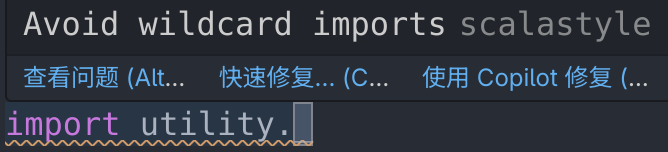
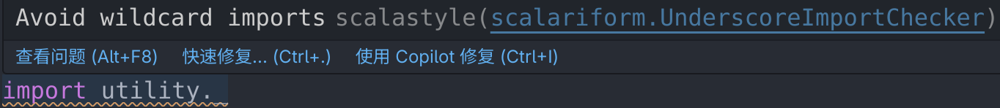

# vscode-scalalint

## Features

This extension uses multiple backends to provide linting for Scala code in VS Code.

- [x] [scalastyle](https://www.scalastyle.org/)
- [ ] ...

It can automatically download those backends. For example, when you open a scala project for the first time after installing the extension, you will be prompted to download the scalastyle backend, just click "Yes" to proceed.

## Requirements

Each backend may have its own requirements.

- scalastyle
  - Java runtime environment
  - A `scalastyle-config.xml` file in your workspace root

## Extension Settings

### `scalalint.runOnSave`

Automatically run scalalint on file save.

Default is `true`.

### `scalalint.<backend>.enable`

Enable or disable a specific backend. In which `<backend>` is the name of the backend, such as `scalastyle`.

Default is `true`.

### scalastyle specific settings

#### `scalalint.scalastyle.configFile`

Path to the `scalastyle-config.xml` file.

This file is required for scalastyle to work properly. You can refer to the [scalastyle documentation](https://www.scalastyle.org/) for more details on how to configure this file.

Default is `./scalastyle-config.xml`, where `.` refers to the workspace root directory.

#### `scalalint.scalastyle.parseConfig`

Whether to parse the `scalastyle-config.xml` file to provide more detailed diagnostics, including rule names and line numbers.

Example disabled:

Example enabled:

and you're able to click on the under-scored part of the diagnostic to jump to the rule in the `scalastyle-config.xml` file.

Default is `true`.

## Commands

- `scalalint.run`: Run scalastyle on the current file.
- `scalalint.cleanup`: Clean up the stored backend data, including downloaded backend binaries. Useful when you want to re-download the backend binaries.
- `scalalint.reload`: Reload the scalalint extension & configurations. Useful when you change the configurations (e.g. `scalastyle-config.xml`).

## Known Issues

None

## Release Notes

Refer to [CHANGELOG](./CHANGELOG.md) file for detail.
